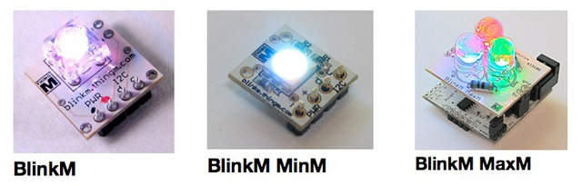

BlinkM-Arduino
==============

Official [BlinkM](https://blinkm.thingm.com/) library and examples by [ThingM](https://thingm.com/)

## How to use this library

1. Click the "Download Zip" button under the **"Code"** button above. You will get a "BlinkM-Arduino-main.zip" file

2. In the Arduino IDE, go to **"Sketch / Include Library / Add .ZIP library..."**

3. Find the "BlinkM-Arduino-main.zip" you download in (1) and click "Open",
   * Arduino will add the BlinkM library to your sketchbook/libraries folder

4. Restart the Arduino IDE

5. Now under **"File / Examples"**, you should see "BlinkM" and several example sketches.
   * (in Arduino IDE 2.0, you will to select a Board first)

6. Open one up, pick your Arduino board, and click **"Verify/Compile"**.
